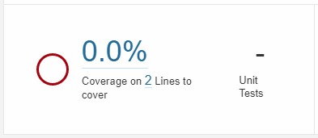
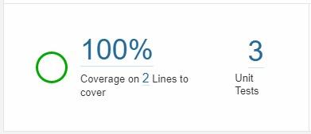

# Sample using `cypress-sonarqube-reporter`

## Prerequisites

-   `yarn` is installed,
-   a SonarQube is running (at least a local one)

## Usage

To see the reporter in action, clone (or download) this repo and execute the following commands:

-   `yarn install` install the project dependencies,
-   `yarn ci` start the webpack dev server (through react-scripts), wait for server to be ready, and run Cypress tests (with `cypress-sonarqube-reporter`). This command will failed because some tests intentionally failed (in order to see the result of all test status)
-   `yarn sonar` run a SonarQube analysis configured to take into account the `cypress-sonarqube-reporter` generated report(s).

You should see a new SonarQube project named `cypress-sonarqube-reporter-sample` with a dashboard that present unit tests execution and code coverage:

<table align="center">
	<tr>
		<td>
			<p>Before</p>
			
		</td>
		<td>
			<p>After</p>
			
		</td>
	</tr>
</table>

## Explanations step by step

### Declare and configure the reporter

Add (and eventually configure) the `cypress-sonarqube-reporter` in `./cypress.json`:

```json
{
    "reporter": "cypress-sonarqube-reporter",
    "reporterOptions": {
        "overwrite": true
    }
}
```

### Merge generated reports into a single report

The reporter generates a SonarQube XML report by Spec file. To ease the SonarQube analysis, these reprots could be merge into a single file.
Add the merge configuration into the `./cypress/plugins/index.js`:

```javascript
/**
 * @type {Cypress.PluginConfig}
 */
module.exports = (on, config) => {
    // https://docs.cypress.io/api/plugins/after-run-api
    on('after:run', (results) => {
		// /!\ don't forget to return the Promise /!\
        return require('cypress-sonarqube-reporter/mergeReports')(results);
    });

    require('@cypress/code-coverage/task')(on, config);

    return config;
};
```

:cherries: Add the code coverage Cypress plugin to collect code coverage, and don't forget to import the `support` in the `./cypress/support/index.js`:

```javascript
import '@cypress/code-coverage/support';
```

### Configure SonarQube analysis

This step uses the [`sonarqube-scanner`](https://github.com/bellingard/sonar-scanner-npm), usefull for web applications, add the analysis parameter:

`-Dsonar.testExecutionReportPaths=dist/cypress-sonarqube-reports.all.xml`

:cherries: Add the LCOV code coverage report:

`-Dsonar.javascript.lcov.reportPaths=dist/coverage/lcov.info`

## Usefull links

-   [SonarQube Analysis Parameters](https://docs.sonarqube.org/latest/analysis/analysis-parameters/)
-   [SonarQube Test Coverage & Execution](https://docs.sonarqube.org/latest/analysis/coverage/)
-   [NPM module to run SonarQube/SonarCloud analyses](https://github.com/bellingard/sonar-scanner-npm)
-   [Cypress plugin for code coverage](https://github.com/cypress-io/code-coverage)
-   [Cypress code coverage for applications created using create-react-app v3](https://www.cypress.io/blog/2019/09/05/cypress-code-coverage-for-create-react-app-v3/)
-   [Cypress module to instrument a CRA app](https://github.com/cypress-io/instrument-cra)
-   [Configuring NYC](https://github.com/istanbuljs/nyc#configuring-nyc)
